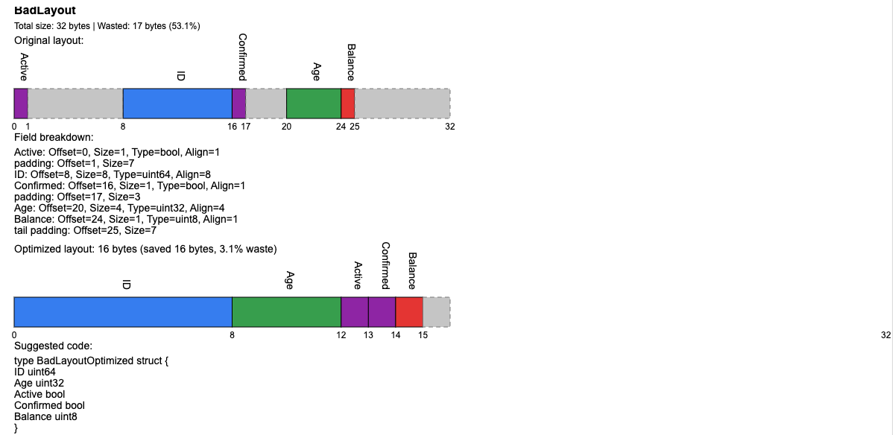

 [](https://viztruct.vercel.app/) [](https://github.com/buarki/viztruct/actions/workflows/release.yml)


# viztruct


SVG visualization:



## CLI installation

### Download binaries

```sh
ARCH="arm64" # or amd64
OS="darwin" # or linux

# get latest tag using GitHub API
VERSION=$(curl -s "https://api.github.com/repos/buarki/viztruct/releases/latest" | jq -r .tag_name)

# download binary
BINARY_URL="https://github.com/buarki/viztruct/releases/download/$VERSION/viztruct-$OS-$ARCH"
curl -L "$BINARY_URL" -o viztruct

# install
chmod +x viztruct
sudo mv viztruct /usr/local/bin/

# verify
viztruct --version
```

### Build it locally

Build the CLI:
```sh
git clone git@github.com:buarki/viztruct.git
cd viztruct
make build-cli
sudo mv viztruct /usr/local/bin/
```

## Usage:
```sh
# Analyze a struct from command line
viztruct --struct 'type MyStruct struct { A int8; B int32 }'

# Analyze structs from a file
viztruct --file ./samples/bad-layout.txt

# Get JSON output
viztruct --format json --struct 'type MyStruct struct { A int8; B int32 }'

# Generate SVG visualization
viztruct --svg --struct 'type MyStruct struct { A int8; B int32 }'

# Show help
viztruct --help
```

The tool will print the struct layout analysis to stdout. Use the `--svg` flag to generate an SVG visualization.

## Website

If you want to use from browser just visit the [deployed webapp](https://viztruct.vercel.app). You can paste/type your struct in the text input area and get a full padding analysis.

## Limitations

For now it is not able to handle structs with types not present in the input provided, for instance:

```go
type Info struct {
	Name            string        `json:"name"`
	Type            *types.Struct `json:"type,omitempty,omitzero"`
	OriginalSize    int64         `json:"original_size"`
	OptimizedSize   int64         `json:"optimized_size"`
	WastedBytes     int64         `json:"wasted_bytes"`
	WastedPercent   float64       `json:"wasted_percent"`
	Fields          []Field       `json:"fields"`
	OptimizedFields []Field       `json:"optimized_fields"`
}

type Field struct {
	Name      string `json:"name"`
	TypeName  string `json:"type,omitempty,omitzero"`
	Offset    int64  `json:"offset"`
	Size      int64  `json:"size"`
	Align     int64  `json:"align"`
	IsPadding bool   `json:"is_padding"`
}
```

The type `types.Struct` is just not defined at above input, this kind of input is currently not supported. 


