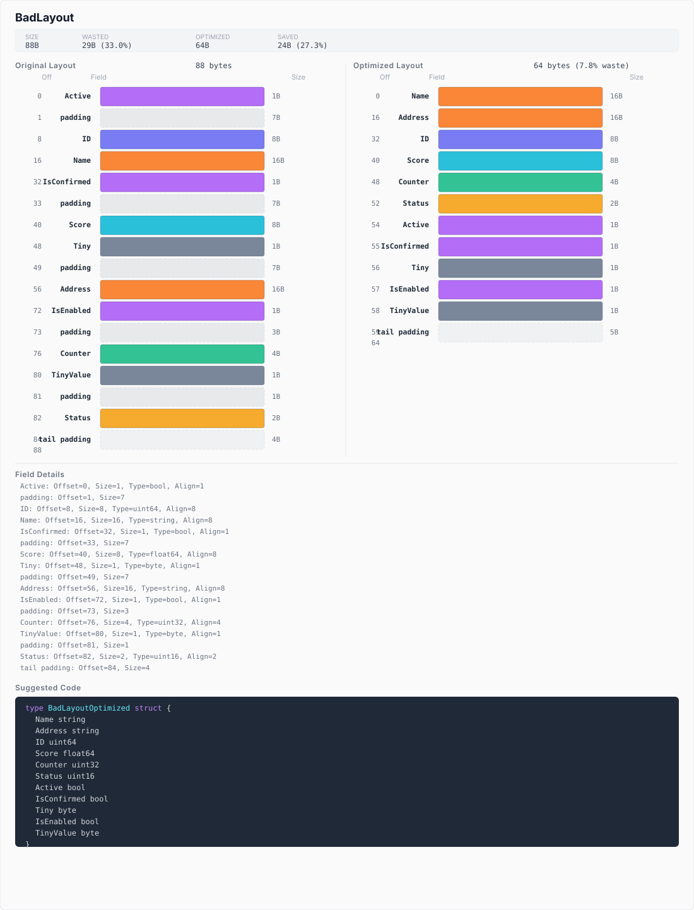

 [](https://viztruct.vercel.app/) [](https://github.com/buarki/viztruct/actions/workflows/release.yml)


# viztruct

## Table of Contents
- [CLI installation](#cli-installation)
- [Usage](#usage)
- [Minimalist webapp](#website)
- [CI/CD plugin](./cmd/ci-plugin/README.md)


SVG visualization:



## CLI installation

### Go install

```sh
go install github.com/buarki/viztruct/cmd/viztruct@latest
```

### Download binaries

```sh
ARCH="arm64" # or amd64
OS="darwin" # or linux

# get latest tag using GitHub API
VERSION=$(curl -s "https://api.github.com/repos/buarki/viztruct/releases/latest" | jq -r .tag_name)

# download binary
BINARY_URL="https://github.com/buarki/viztruct/releases/download/$VERSION/viztruct-$OS-$ARCH"
curl -L "$BINARY_URL" -o viztruct

# install
chmod +x viztruct
sudo mv viztruct /usr/local/bin/

# verify
viztruct --version
```

### Build it locally

Build the CLI:
```sh
git clone git@github.com:buarki/viztruct.git
cd viztruct
make build-cli
sudo mv viztruct /usr/local/bin/
```

## Usage:

### Analyze structs from a path

```sh
viztruct --path ./internal/samples --format=txt
```

### Get JSON output
```sh
viztruct --path ./internal/samples --format=json
```

### Generate SVG visualization
```sh
viztruct --path ./internal/samples --format=json --svg
```

### Analyze and define the optimization strategy
```sh
viztruct --path ./internal/samples --format=txt --strategies=alignment,size,group,greedy
```

### Show help
```sh
viztruct --help
```

The tool will print the struct layout analysis to stdout. Use the `--svg` flag to generate an SVG visualization.

## Minimalist webapp

If you want to use a limited version of viztruct (since it supports only explicitly defined types) in your browser just visit the [deployed webapp](https://viztruct.vercel.app). You can paste/type your struct in the text input area and get a full padding analysis.
